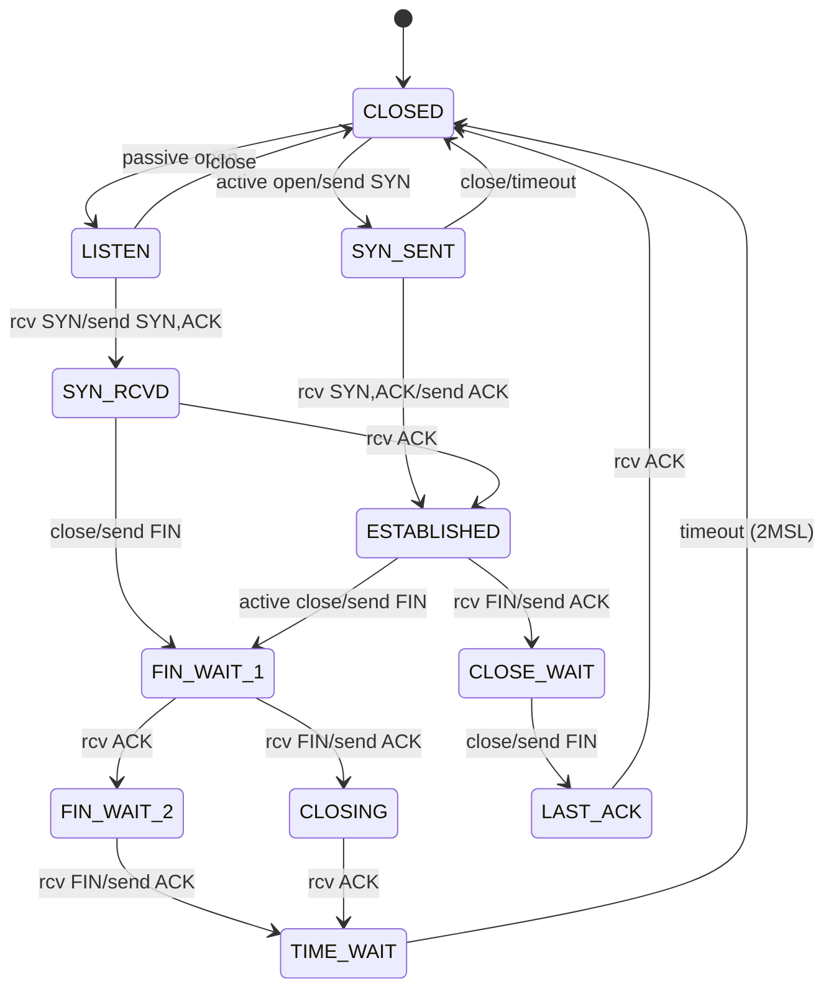

### TCP固定头部结构


### TCP连接的建立和关闭

#### 案例演示


该报文是使用 `tcpdump` 捕获的TCP通信流量。以下是对报文的详细分析：

1. **基本信息**
   - 捕获接口：`ens33`
   - 过滤条件：`port 8000`

2. **报文解析**

   报文1：
   ```
   07:58:01.141569 IP 192.168.42.108.45714 > 192.168.42.109.8000: Flags [S], seq 1068669254, win 64240, options [mss 1460,sackOK,TS val 140423370 ecr 0,nop,wscale 7], length 0
   ```
   - 时间戳：07:58:01.141569
   - 源地址和端口：192.168.42.108:45714
   - 目标地址和端口：192.168.42.109:8000
   - 标志：S (SYN)
   - 序列号：1068669254
   - 窗口大小：64240
   - 选项：最大报文段大小 (MSS) 1460, SACK 允许, 时间戳 140423370, 窗口扩大系数 7
   - 数据长度：0

   报文2：
   ```
   07:58:01.141682 IP 192.168.42.109.8000 > 192.168.42.108.45714: Flags [S.], seq 3335247323, ack 1068669255, win 65160, options [mss 1460,sackOK,TS val 2108381470 ecr 140423370,nop,wscale 7], length 0
   ```
   - 时间戳：07:58:01.141682
   - 源地址和端口：192.168.42.109:8000
   - 目标地址和端口：192.168.42.108:45714
   - 标志：S (SYN-ACK)
   - 序列号：3335247323
   - 确认号：1068669255
   - 窗口大小：65160
   - 选项：MSS 1460, SACK 允许, 时间戳 2108381470, 窗口扩大系数 7
   - 数据长度：0

   报文3：
   ```
   07:58:01.143251 IP 192.168.42.108.45714 > 192.168.42.109.8000: Flags [.], ack 1, win 502, options [nop,nop,TS val 140423372 ecr 2108381470], length 0
   ```
   - 时间戳：07:58:01.143251
   - 源地址和端口：192.168.42.108:45714
   - 目标地址和端口：192.168.42.109:8000
   - 标志：. (ACK)
   - 确认号：1
   - 窗口大小：502
   - 选项：时间戳 140423372
   - 数据长度：0

   这三条报文表示TCP连接的三次握手过程成功建立。

   报文4：
   ```
   07:58:35.318968 IP 192.168.42.108.45714 > 192.168.42.109.8000: Flags [P.], seq 1:4, ack 1, win 502, options [nop,nop,TS val 140457563 ecr 2108381470], length 3
   ```
   - 时间戳：07:58:35.318968
   - 源地址和端口：192.168.42.108:45714
   - 目标地址和端口：192.168.42.109:8000
   - 标志：P (PUSH-ACK)
   - 序列号：1:4
   - 确认号：1
   - 窗口大小：502
   - 选项：时间戳 140457563
   - 数据长度：3

   报文5：
   ```
   07:58:35.319054 IP 192.168.42.109.8000 > 192.168.42.108.45714: Flags [.], ack 4, win 510, options [nop,nop,TS val 2108415648 ecr 140457563], length 0
   ```
   - 时间戳：07:58:35.319054
   - 源地址和端口：192.168.42.109:8000
   - 目标地址和端口：192.168.42.108:45714
   - 标志：. (ACK)
   - 确认号：4
   - 窗口大小：510
   - 选项：时间戳 2108415648
   - 数据长度：0

   报文6：
   ```
   07:58:35.320106 IP 192.168.42.109.8000 > 192.168.42.108.45714: Flags [P.], seq 1:493, ack 4, win 510, options [nop,nop,TS val 2108415649 ecr 140457563], length 492
   ```
   - 时间戳：07:58:35.320106
   - 源地址和端口：192.168.42.109:8000
   - 目标地址和端口：192.168.42.108:45714
   - 标志：P (PUSH-ACK)
   - 序列号：1:493
   - 确认号：4
   - 窗口大小：510
   - 选项：时间戳 2108415649
   - 数据长度：492

   报文7：
   ```
   07:58:35.320335 IP 192.168.42.109.8000 > 192.168.42.108.45714: Flags [F.], seq 493, ack 4, win 510, options [nop,nop,TS val 2108415649 ecr 140457563], length 0
   ```
   - 时间戳：07:58:35.320335
   - 源地址和端口：192.168.42.109:8000
   - 目标地址和端口：192.168.42.108:45714
   - 标志：F (FIN-ACK)
   - 序列号：493
   - 确认号：4
   - 窗口大小：510
   - 选项：时间戳 2108415649
   - 数据长度：0

   报文8：
   ```
   07:58:35.321766 IP 192.168.42.108.45714 > 192.168.42.109.8000: Flags [.], ack 493, win 501, options [nop,nop,TS val 140457565 ecr 2108415649], length 0
   ```
   - 时间戳：07:58:35.321766
   - 源地址和端口：192.168.42.108:45714
   - 目标地址和端口：192.168.42.109:8000
   - 标志：. (ACK)
   - 确认号：493
   - 窗口大小：501
   - 选项：时间戳 140457565
   - 数据长度：0

   报文9：
   ```
   07:58:35.322149 IP 192.168.42.108.45714 > 192.168.42.109.8000: Flags [F.], seq 4, ack 494, win 501, options [nop,nop,TS val 140457566 ecr 2108415649], length 0
   ```
   - 时间戳：07:58:35.322149
   - 源地址和端口：192.168.42.108:45714
   - 目标地址和端口：192.168.42.109:8000
   - 标志：F (FIN-ACK)
   - 序列号：4
   - 确认号：494
   - 窗口大小：501
   - 选项：时间戳 140457566
   - 数据长度：0

   报文10：
   ```
   07:58:35.322208 IP 192.168.42.109.8000 > 192.168.42.108.45714: Flags [.], ack 5, win 510, options [nop,nop,TS val 2108415651 ecr 140457566], length 0
   ```
   - 时间戳：07:58:35.322208
   - 源地址和端口：192.168.42.109

:8000
   - 目标地址和端口：192.168.42.108:45714
   - 标志：. (ACK)
   - 确认号：5
   - 窗口大小：510
   - 选项：时间戳 2108415651
   - 数据长度：0

   这几条报文表示TCP连接的四次挥手过程成功断开。

3. **总结**
   - 192.168.42.108:45714 与 192.168.42.109:8000 建立了一个TCP连接。
   - 三次握手成功完成，表示连接建立成功。
   - 之后发生了数据传输，其中192.168.42.108向192.168.42.109发送了3字节的数据，而192.168.42.109向192.168.42.108发送了492字节的数据。
   - 最后，双方进行了四次挥手，成功断开连接。
  

为了更形象地展示TCP连接建立、数据传输和断开的过程，可以使用序列图的形式。这种图表能更清晰地表示客户端和服务器之间的交互。下面是基于您提供的数据绘制的时序图：

```plaintext
客户端 (192.168.42.108:45714)                          服务器 (192.168.42.109:8000)
|                                                       |
|  07:58:01.141569  SYN, seq=1068669254                 |
|------------------------------------------------------>|
|                                                       |
|  07:58:01.141682  SYN-ACK, seq=3335247323, ack=1068669255  |
|<------------------------------------------------------|
|                                                       |
|  07:58:01.143251  ACK, ack=1                          |
|------------------------------------------------------>|
|                                                       |
|  07:58:35.318968  PSH-ACK, seq=1:4, len=3             |
|------------------------------------------------------>|
|                                                       |
|  07:58:35.319054  ACK, ack=4                          |
|<------------------------------------------------------|
|                                                       |
|  07:58:35.320106  PSH-ACK, seq=1:493, len=492         |
|<------------------------------------------------------|
|                                                       |
|  07:58:35.320335  FIN-ACK, seq=493, ack=4             |
|<------------------------------------------------------|
|                                                       |
|  07:58:35.321766  ACK, ack=493                        |
|------------------------------------------------------>|
|                                                       |
|  07:58:35.322149  FIN-ACK, seq=4, ack=494             |
|------------------------------------------------------>|
|                                                       |
|  07:58:35.322208  ACK, ack=5                          |
|<------------------------------------------------------|
|                                                       |
```

### 解释

1. **三次握手建立连接**
   - `07:58:01.141569`：客户端发送 SYN 报文给服务器，表示请求建立连接。
   - `07:58:01.141682`：服务器回复 SYN-ACK 报文，确认收到连接请求，并表示愿意建立连接。
   - `07:58:01.143251`：客户端发送 ACK 报文确认，三次握手完成，连接建立。

2. **数据传输**
   - `07:58:35.318968`：客户端发送 PSH-ACK 报文，包含3字节数据。
   - `07:58:35.319054`：服务器回复 ACK 报文，确认收到数据。
   - `07:58:35.320106`：服务器发送 PSH-ACK 报文，包含492字节数据。

3. **四次挥手断开连接**
   - `07:58:35.320335`：服务器发送 FIN-ACK 报文，表示请求断开连接。
   - `07:58:35.321766`：客户端回复 ACK 报文，确认收到断开连接请求。
   - `07:58:35.322149`：客户端发送 FIN-ACK 报文，表示同意断开连接。
   - `07:58:35.322208`：服务器回复 ACK 报文，确认断开连接请求，连接断开。

该时序图用直观的方式展示了TCP连接的建立、数据传输和断开过程的每一步骤。


在TCP报文中，标志位用于控制和管理TCP连接的状态。每个标志位有不同的作用，常见的TCP标志位包括SYN、ACK、FIN、RST、PSH、URG等。下面是对这些标志位的详细解释及其在TCP连接过程中的作用：

1. **SYN (同步序列号)**：
   - 用于建立连接的初始同步序列号。表示希望发起一个新连接。
   - 在三次握手的第一个报文中，客户端发送SYN标志位请求连接。
   - 服务器收到后，响应一个SYN-ACK报文。

2. **ACK (确认序列号)**：
   - 表示对接收数据的确认。每个数据包通常都会携带ACK以确认已收到之前的数据包。
   - 在三次握手中，客户端和服务器都使用ACK标志位确认连接建立。
   - 在数据传输过程中，接收方发送ACK标志位确认数据的接收。

3. **FIN (结束连接)**：
   - 用于优雅地关闭连接。表示发送方完成数据传输，准备关闭连接。
   - 在四次挥手中，用于表示连接的关闭请求。

4. **RST (复位)**：
   - 用于强制关闭连接。表示存在错误或需要立即终止连接。
   - 当一个连接出现异常或需要立即断开时，会发送带有RST标志位的报文。

5. **PSH (推送)**：
   - 用于将数据推送给接收应用层。表示数据需要立即被处理。
   - 当数据需要立即传输并处理时，会设置PSH标志位。

6. **URG (紧急)**：
   - 表示数据具有高优先级，需要紧急处理。
   - 紧急指针字段和URG标志位结合使用，指示紧急数据的结束位置。

### 三次握手 (建立连接)

```plaintext
客户端 (Client)                          服务器 (Server)
|                                            |
|----SYN seq=x------------------------------>|
|                                            |
|<---SYN seq=y, ACK=x+1----------------------|
|                                            |
|----seq=x+1 ACK=y+1 ----------------------->|
|                                            |
```

1. 客户端发送一个带SYN标志位的报文，序列号为x。
2. 服务器回复一个带SYN和ACK标志位的报文，序列号为y，确认号为x+1。
3. 客户端回复一个带ACK标志位的报文，确认号为y+1。

### 数据传输

```plaintext
客户端 (Client)                          服务器 (Server)
|                                            |
|----PSH seq=x, data------------------------>|
|                                            |
|<---ACK seq=x+data-length-------------------|
|                                            |
```

1. 客户端发送一个带PSH标志位的报文，包含数据和序列号x。
2. 服务器回复一个带ACK标志位的报文，确认号为x加上数据长度。

### 四次挥手 (断开连接)

```plaintext
客户端 (Client)                          服务器 (Server)
|                                            |
|----FIN seq=x------------------------------>|
|                                            |
|<---ACK seq=x+1-----------------------------|
|                                            |
|<---FIN seq=y-------------------------------|
|                                            |
|----ACK seq=y+1---------------------------->|
|                                            |
```

1. 客户端发送一个带FIN标志位的报文，序列号为x，表示希望断开连接。
2. 服务器回复一个带ACK标志位的报文，确认号为x+1，确认断开请求。
3. 服务器发送一个带FIN标志位的报文，序列号为y，表示同意断开连接。
4. 客户端回复一个带ACK标志位的报文，确认号为y+1，连接正式断开。


通过理解这些标志位及其作用，可以更好地分析和调试TCP连接的建立、数据传输和断开过程。

### TCP的各个状态及其转移过程

当然，我理解您想要更详细地了解 TCP 状态转移过程。让我为您提供一个更全面的解释，包括所有主要的状态和它们之间的转移。




现在让我详细解释 TCP 的各个状态及其转移过程：

1. CLOSED：
   - 这是初始状态，表示没有连接。
   - 可以通过主动打开（发送 SYN）转移到 SYN_SENT 状态。
   - 或者通过被动打开转移到 LISTEN 状态。

2. LISTEN：
   - 服务器在等待连接请求。
   - 如果收到 SYN，发送 SYN+ACK 后转移到 SYN_RCVD 状态。
   - 如果关闭，则回到 CLOSED 状态。

3. SYN_SENT：
   - 客户端已发送 SYN，等待服务器的 SYN+ACK。
   - 如果收到 SYN+ACK，发送 ACK 后转移到 ESTABLISHED 状态。
   - 如果超时或关闭，则回到 CLOSED 状态。

4. SYN_RCVD：
   - 服务器已收到 SYN 并发送 SYN+ACK，等待客户端的 ACK。
   - 如果收到 ACK，转移到 ESTABLISHED 状态。
   - 如果本地关闭，发送 FIN 后转移到 FIN_WAIT_1 状态。

5. ESTABLISHED：
   - 连接建立，可以进行数据传输。
   - 如果主动关闭，发送 FIN 后转移到 FIN_WAIT_1 状态。
   - 如果收到对方的 FIN，发送 ACK 后转移到 CLOSE_WAIT 状态。

6. FIN_WAIT_1：
   - 已发送 FIN，等待对方的 ACK。
   - 如果收到 ACK，转移到 FIN_WAIT_2 状态。
   - 如果收到 FIN，发送 ACK 后转移到 CLOSING 状态。

7. CLOSE_WAIT：
   - 已收到对方的 FIN 并发送 ACK，等待本地应用关闭连接。
   - 当本地应用关闭连接，发送 FIN 后转移到 LAST_ACK 状态。

8. FIN_WAIT_2：
   - 已收到对方对 FIN 的确认，等待对方发送 FIN。
   - 收到 FIN 后，发送 ACK，转移到 TIME_WAIT 状态。

9. CLOSING：
   - 双方同时关闭连接的情况，等待对方的 ACK。
   - 收到 ACK 后转移到 TIME_WAIT 状态。

10. LAST_ACK：
    - 被动关闭方已发送 FIN，等待最后的 ACK。
    - 收到 ACK 后转移到 CLOSED 状态。

11. TIME_WAIT：
    - 等待足够的时间以确保对方收到了最后的 ACK。
    - 通常持续 2MSL（最大报文段生存时间）后转移到 CLOSED 状态。

这个状态图和解释涵盖了 TCP 连接的完整生命周期，包括连接的建立、数据传输和连接的终止。理解这些状态和转移对于深入掌握 TCP 协议和进行网络编程非常重要。


让我们尝试一种不同的方式来展示 TCP 的状态转移，将其分为客户端和服务器两部分，这样可能会更加直观。

```mermaid
graph TD
    subgraph Client
    C_CLOSED[CLOSED]
    C_SYN_SENT[SYN_SENT]
    C_ESTABLISHED[ESTABLISHED]
    C_FIN_WAIT_1[FIN_WAIT_1]
    C_FIN_WAIT_2[FIN_WAIT_2]
    C_TIME_WAIT[TIME_WAIT]
    end

    subgraph Server
    S_CLOSED[CLOSED]
    S_LISTEN[LISTEN]
    S_SYN_RCVD[SYN_RCVD]
    S_ESTABLISHED[ESTABLISHED]
    S_CLOSE_WAIT[CLOSE_WAIT]
    S_LAST_ACK[LAST_ACK]
    end

    C_CLOSED -->|1. 发送 SYN| C_SYN_SENT
    S_LISTEN -->|2. 接收 SYN, 发送 SYN+ACK| S_SYN_RCVD
    C_SYN_SENT -->|3. 接收 SYN+ACK, 发送 ACK| C_ESTABLISHED
    S_SYN_RCVD -->|4. 接收 ACK| S_ESTABLISHED

    C_ESTABLISHED -->|5. 发送 FIN| C_FIN_WAIT_1
    S_ESTABLISHED -->|6. 接收 FIN, 发送 ACK| S_CLOSE_WAIT
    C_FIN_WAIT_1 -->|7. 接收 ACK| C_FIN_WAIT_2
    S_CLOSE_WAIT -->|8. 发送 FIN| S_LAST_ACK
    C_FIN_WAIT_2 -->|9. 接收 FIN, 发送 ACK| C_TIME_WAIT
    S_LAST_ACK -->|10. 接收 ACK| S_CLOSED
    C_TIME_WAIT -->|11. 等待 2MSL| C_CLOSED

```




这个简化的图表展示了 TCP 连接的主要状态转移，分为客户端和服务器两部分。让我为您解释主要的步骤：

1. 连接建立（三次握手）：
   - 客户端从 CLOSED 状态发送 SYN，进入 SYN_SENT 状态。
   - 服务器从 LISTEN 状态接收 SYN，发送 SYN+ACK，进入 SYN_RCVD 状态。
   - 客户端接收 SYN+ACK，发送 ACK，进入 ESTABLISHED 状态。
   - 服务器接收 ACK，也进入 ESTABLISHED 状态。

2. 数据传输：
   - 双方在 ESTABLISHED 状态下可以自由传输数据。

3. 连接终止（四次挥手）：
   - 客户端发起关闭，发送 FIN，进入 FIN_WAIT_1 状态。
   - 服务器接收 FIN，发送 ACK，进入 CLOSE_WAIT 状态。
   - 客户端接收 ACK，进入 FIN_WAIT_2 状态。
   - 服务器发送 FIN，进入 LAST_ACK 状态。
   - 客户端接收 FIN，发送 ACK，进入 TIME_WAIT 状态。
   - 服务器接收 ACK，回到 CLOSED 状态。
   - 客户端等待 2MSL 时间后，也回到 CLOSED 状态。

这个图表省略了一些不太常见的状态（如 CLOSING 状态），聚焦于典型的 TCP 连接生命周期。

主要优点：
1. 清晰地区分了客户端和服务器的状态。
2. 按时间顺序展示了状态的变化。
3. 显示了导致状态变化的关键事件（如发送或接收特定的包）。


