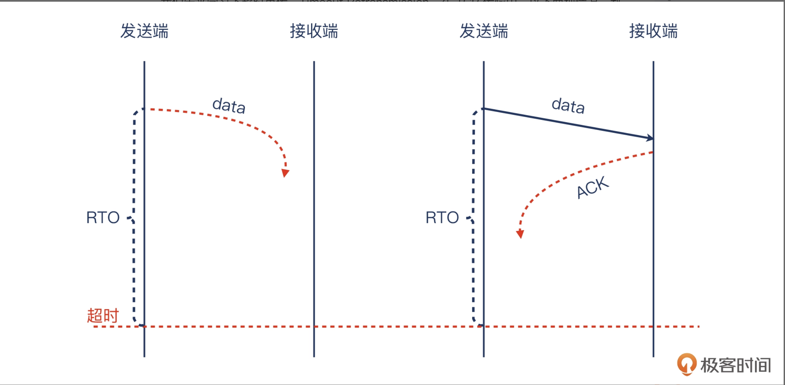

### 超时重传

我们先来学习下超时重传，Timeout Retransmission。在 TCP 传输中，以下两种情况，都可能会导致发送方收不到确认：报文在发送途中丢失，没有到达接收方，那接收方也不会回复确认包。报文到达接收方，接收方也回复了确认，但确认包在途中丢失。

没有收到确认怎么办？发送方为了避免自己陷入“尬等”的境地，选择在等待某段时间后重新发送同样这份报文，这个等待的时间就是重传超时，Retransmission Timeout，简称 RTO。这个 Timeout 其实是基于一个计时器，在报文发送出去后就开始计时，在时限内对方回复 ACK 的话，计时器就清零；而如果达到时限对方还没回复 ACK 的话，重传操作就被触发。

当然，超时重传也还是可能会丢包，此时发送方一般会以 RTO 为基数的 2 倍、4 倍、8 倍等时间倍数去尝试多次。

要展示一个TCP重传（TCP Retransmission）的抓包示例，通常我们会使用工具如Wireshark进行分析。以下是如何识别TCP重传的基本过程以及一个抓包示例的描述。

### 抓包示例说明
1. **正常的TCP连接**：
   - 客户端与服务器建立连接后，客户端发送数据包。
   - 服务器会对每个收到的数据包发送一个确认包（ACK）。
   - 正常情况下，每个数据包都应得到ACK确认。

2. **数据包丢失**：
   - 某个数据包在网络传输过程中丢失或延迟。
   - 服务器没有收到丢失的数据包，并且不会对这个丢失的数据包发送ACK。

3. **TCP重传发生**：
   - 客户端等待了一段时间后，没有收到服务器的ACK确认。
   - 客户端认为这个数据包可能丢失，触发重传机制，重新发送这个丢失的数据包。

### 抓包中的典型重传标志
在抓包工具中，如Wireshark，TCP重传通常有以下特征：
- **Retransmission**：如果数据包超时未确认，TCP会重发该数据包，Wireshark会标记为 "TCP Retransmission"。
- **Duplicate ACK**：如果服务器收到了后续的数据包但丢失了其中的一个包，它会重复发送上一个确认包，这种现象称为重复ACK（Duplicate ACK），Wireshark会标记为 "Dup ACK"。
- **TCP Fast Retransmission**：当发送方收到三次重复ACK时，快速重传机制被触发，无需等待超时，Wireshark会标记为 "TCP Fast Retransmission"。

### 抓包示例的解释

假设我们在Wireshark中看到以下抓包记录：

| No.  | Time       | Source IP   | Destination IP | Protocol | Length | Info                               |
|------|------------|-------------|----------------|----------|--------|------------------------------------|
| 1    | 0.000000   | 192.168.1.2 | 192.168.1.10   | TCP      | 66     | SYN                                |
| 2    | 0.000050   | 192.168.1.10| 192.168.1.2    | TCP      | 66     | SYN, ACK                           |
| 3    | 0.000100   | 192.168.1.2 | 192.168.1.10   | TCP      | 66     | ACK                                |
| 4    | 0.000150   | 192.168.1.2 | 192.168.1.10   | TCP      | 200    | Data Seq=1 ACK=1                   |
| 5    | 0.000200   | 192.168.1.10| 192.168.1.2    | TCP      | 66     | ACK Seq=1 ACK=201                  |
| 6    | 0.000250   | 192.168.1.2 | 192.168.1.10   | TCP      | 200    | Data Seq=201 ACK=1                 |
| 7    | 0.100300   | 192.168.1.2 | 192.168.1.10   | TCP      | 200    | [TCP Retransmission] Data Seq=201  |
| 8    | 0.100350   | 192.168.1.10| 192.168.1.2    | TCP      | 66     | ACK Seq=201 ACK=401                |

### 关键点分析
1. **No.1, No.2, No.3**：TCP的三次握手。
2. **No.4, No.5**：客户端发送数据包，服务器正常确认。
3. **No.6**：客户端继续发送第二个数据包，序列号为201。
4. **No.7**：重传事件，时间差显示为0.100秒，说明该数据包在发送后，客户端没有收到ACK，因此重新发送序列号为201的包。
5. **No.8**：服务器在重传后确认收到该包，发送ACK确认包。

### 总结
- **Retransmission**：第7个包标记为重传，表示客户端检测到它之前发送的数据包没有收到服务器的确认，因此重发。
- **ACK**：第8个包表示服务器已经确认收到之前丢失的数据包。

这个示例清楚地展示了TCP重传的过程，重传的触发是因为丢失的ACK或者超时未确认。如果你要在Wireshark中捕获类似的包，通常可以通过设置过滤器 `tcp.analysis.retransmission` 来查看所有重传的包。

### Wireshark过滤器
- **过滤TCP重传包**： `tcp.analysis.retransmission`
- **过滤快速重传包**： `tcp.analysis.fast_retransmission`
- **过滤重复ACK**：`tcp.analysis.duplicate_ack`

这可以帮助你在复杂的抓包文件中快速定位到重传事件并进行分析。
