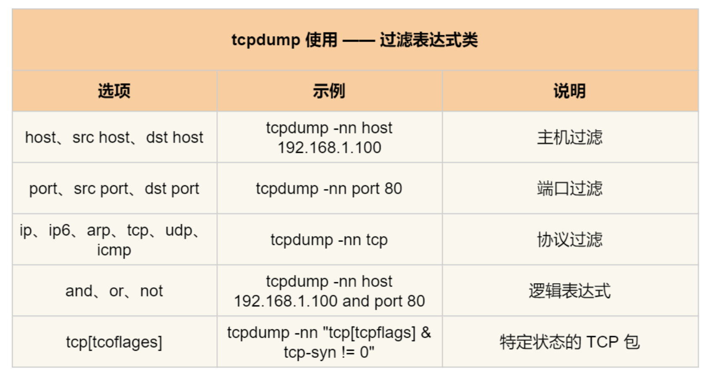

`tcpdump` 是一个强大的命令行工具，用于截获和分析网络数据包。它广泛应用于网络故障排除、性能分析和安全检测等方面。

### tcpdump表达式




### 1. 基本抓包命令

抓取所有流经 `eth0` 接口的数据包：

```shell
sudo tcpdump -i eth0
```

### 2. 抓取指定数量的数据包

抓取10个数据包：

```shell
sudo tcpdump -i eth0 -c 10
```

### 3. 抓取并保存到文件

将抓取的数据包保存到 `capture.pcap` 文件中：

```shell
sudo tcpdump -i eth0 -w capture.pcap
```

### 4. 从文件读取数据包

从文件 `capture.pcap` 中读取并显示数据包：

```shell
sudo tcpdump -r capture.pcap
```

### 5. 抓取指定主机的数据包

抓取与 `192.168.1.1` 相关的数据包：

```shell
sudo tcpdump -i eth0 host 192.168.1.1
```

抓取从 `192.168.1.1` 发出的数据包：

```shell
sudo tcpdump -i eth0 src host 192.168.1.1
```

抓取发送到 `192.168.1.1` 的数据包：

```shell
sudo tcpdump -i eth0 dst host 192.168.1.1
```

### 6. 抓取指定端口的数据包

抓取与端口 80（HTTP）相关的数据包：

```shell
sudo tcpdump -i eth0 port 80
```

抓取源端口为 80 的数据包：

```shell
sudo tcpdump -i eth0 src port 80
```

抓取目标端口为 80 的数据包：

```shell
sudo tcpdump -i eth0 dst port 80
```

### 7. 抓取指定协议的数据包

抓取所有 TCP 数据包：

```shell
sudo tcpdump -i eth0 tcp
```

抓取所有 UDP 数据包：

```shell
sudo tcpdump -i eth0 udp
```

抓取所有 ICMP 数据包：

```shell
sudo tcpdump -i eth0 icmp
```

### 8. 抓取并显示数据包内容

显示抓取数据包的完整内容：

```shell
sudo tcpdump -i eth0 -A
```

显示抓取数据包的十六进制和ASCII内容：

```shell
sudo tcpdump -i eth0 -X
```

### 9. 使用表达式进行复杂过滤

抓取从 `192.168.1.1` 发出的且目标端口为 80 的 TCP 数据包：

```shell
sudo tcpdump -i eth0 src host 192.168.1.1 and tcp dst port 80
```

### 10. 只抓取ARP数据包

抓取所有 ARP 数据包：

```shell
sudo tcpdump -i eth0 arp
```

### 11. 抓取特定时间段的数据包

设置抓包持续时间为 30 秒：

```shell
sudo timeout 30 tcpdump -i eth0
```

### 12. 抓取 VLAN 数据包

抓取 VLAN ID 为 10 的数据包：

```shell
sudo tcpdump -i eth0 vlan 10
```

### 两个指定IP地址之间传输的数据包

```
sudo tcpdump-i eth0-ent'(dst 192.168.1.109 and src 192.168.1.108)or
(dst 192.168.1.108 and src 192.168.1.109)'
```

### 示例总结

`tcpdump` 的强大功能使其成为网络分析的重要工具。通过灵活使用各种过滤条件和选项，用户可以精确地截获并分析特定类型的数据包，帮助快速定位网络问题并进行深入的网络研究和分析。


