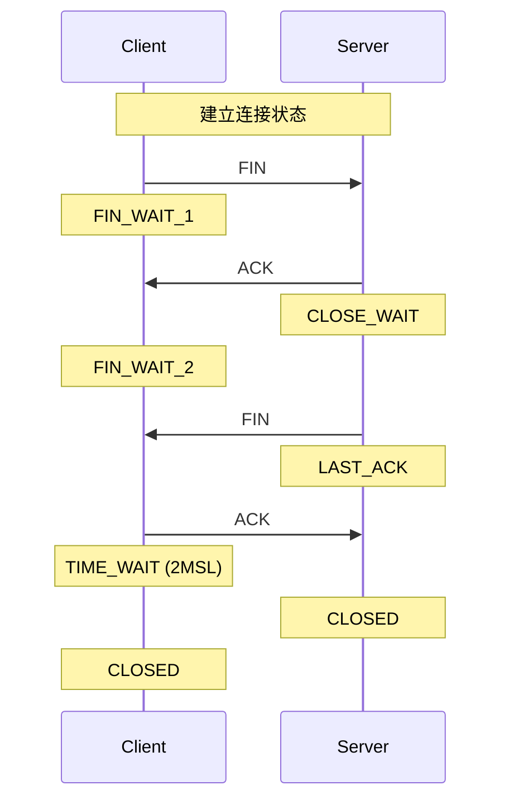
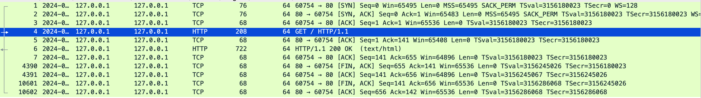
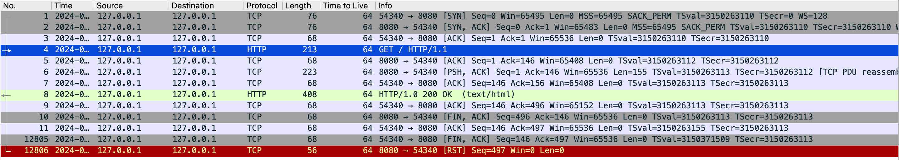
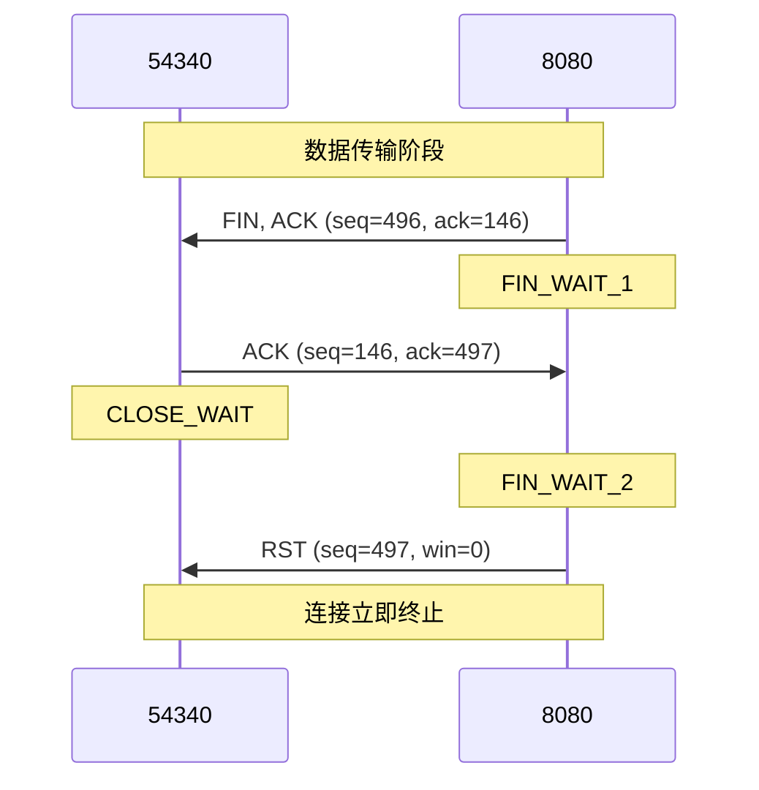

### tcp 四次挥手

#### 四次挥手

当然，我可以为您创建一个TCP四次挥手过程的图示。这将有助于更直观地理解整个过程。

这个图示展示了TCP四次挥手的完整过程。让我为您解释一下图中的各个步骤：

1. 首先，客户端和服务器处于已建立连接的状态。

2. 第一次挥手：
   - 客户端发送FIN包给服务器，表示客户端想要关闭连接。
   - 客户端进入FIN_WAIT_1状态。

3. 第二次挥手：
   - 服务器收到FIN包，回复一个ACK确认包。
   - 服务器进入CLOSE_WAIT状态。
   - 客户端收到ACK后，进入FIN_WAIT_2状态。

4. 第三次挥手：
   - 服务器发送FIN包给客户端，表示服务器也准备关闭连接。
   - 服务器进入LAST_ACK状态。

5. 第四次挥手：
   - 客户端收到FIN包，回复一个ACK确认包。
   - 客户端进入TIME_WAIT状态，并等待2MSL时间。
   - 服务器收到ACK后，立即进入CLOSED状态。

6. 最后，在2MSL时间过后，客户端也进入CLOSED状态，连接完全关闭。

这个图示清晰地展示了四次挥手的过程，以及客户端和服务器在每个阶段的状态变化。特别注意客户端在最后阶段的TIME_WAIT状态，这就是我们之前讨论的2MSL等待时间。

> 如何理解2MSL

2MSL（Maximum Segment Lifetime）是TCP四次挥手过程中一个重要的概念。MSL是指一个TCP报文段在网络中的最大生存时间。让我们深入理解2MSL的含义和重要性：

1. MSL的定义：
   - MSL是一个TCP报文段在网络中可以存在的最长时间。
   - 它通常被设置为30秒或1分钟，但具体取决于操作系统的实现。

2. 2MSL的意义：
   - 在四次挥手的最后阶段，发送最后一个ACK的一方（通常是客户端）会等待2MSL的时间。
   - 2MSL = 两倍的MSL时间。

3. 为什么要等待2MSL：
   a) 确保最后的ACK能到达：
      - 如果最后的ACK丢失，服务器会重发FIN包。
      - 2MSL给予足够时间让可能重发的FIN包到达，并再次发送ACK。

   b) 防止"已失效的连接请求报文段"出现在本连接中：
      - 等待时间足够长，确保老连接的报文段在网络中消失。

   c) 确保连接完全关闭：
      - 给予双方足够时间来处理还未传输完成的数据包。

4. 2MSL等待的影响：
   - 在这段时间内，连接使用的端口不能被重新使用。
   - 这可能会短暂影响服务器的连接能力，特别是在高并发场景下。

5. 实际应用考虑：
   - 一些实现可能会通过调整2MSL时间来平衡可靠性和性能。
   - 某些情况下，可以使用SO_REUSEADDR选项来允许更快地重用地址和端口。

理解2MSL有助于我们更好地把握TCP连接关闭的全过程，以及如何在可靠性和性能之间取得平衡。这对于网络编程和系统调优都有重要意义。

#### wireshark抓包演示：正常四次挥手

#### wireshark抓包演示：非正常四次挥手

让我们根据这个关键观察重新审视整个过程：

1. 第一次挥手（FIN, ACK）:
   - 在第10行，8080端口（服务端）向54340端口（客户端）发送 [FIN, ACK] 包。
   - 这表明服务端首先发起了连接关闭请求。

2. 第二次挥手（ACK）:
   - 第11行显示54340端口（客户端）向8080端口（服务端）发送 [ACK] 包。
   - 客户端确认收到了服务端的关闭请求。

3. 异常终止（RST）:
   - 在第12806行，我们看到一个 [RST] 包从8080端口（服务端）发送到54340端口（客户端）。
   - 这个RST（重置）包表明服务端决定立即终止连接，而不是等待正常的四次挥手完成。

关键观察：

这个过程与标准的TCP四次挥手有很大不同。服务端在发送FIN后又发送了RST。该数据包中的 `RST`（Reset）标志表示发送方希望立即终止连接。这种情况通常发生在以下几种情况之一：

1. **避免TIME_WAIT**：有些服务器或者客户端在关闭连接时使用 `RST` 来避免进入 `TIME_WAIT` 状态。在正常的TCP四次挥手中，终止连接的一方会进入 `TIME_WAIT` 状态，以确保远程端点接收到连接终止的ACK确认。然而，使用 `RST` 可以立即释放资源，不必等待 `TIME_WAIT` 定时器结束。这可以加速资源的回收，尤其是在高并发的情况下。

2. **异常终止**：如果一个应用层或传输层发现某些异常，比如连接的另一端无响应或者检测到错误，它可能会发送 `RST` 包来强制终止连接。

在你上传的Wireshark截图中，可以看到最后一个TCP包标记为 `RST`，且它是在 `FIN, ACK` 之后。可能的解释是发送方在收到 `FIN, ACK` 后，为了加速释放资源，主动发送了 `RST` 包以终止连接，避免进入 `TIME_WAIT` 状态。

你可以进一步确认这一点，检查系统的相关网络配置（如 `tcp_tw_recycle` 或 `tcp_tw_reuse`），这些参数在某些系统中控制是否通过 `RST` 避免 `TIME_WAIT`。

