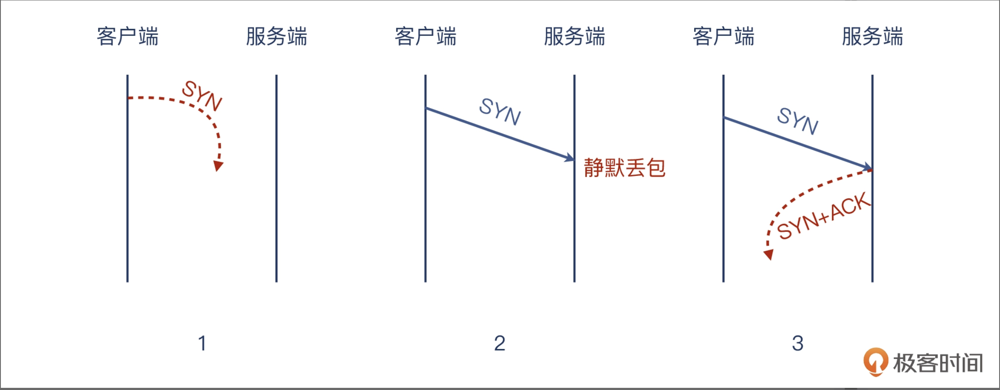

### 静默丢包

一般来说 TCP 连接是标准的 TCP 三次握手完成的：
1. 客户端发送 SYN；
2. 服务端收到 SYN 后，回复 SYN+ACK；
3. 客户端收到 SYN+ACK 后，回复 ACK。
   
这里面 SYN 会在两端各发送一次，表示“我准备好了，可以开始连接了”。ACK 也是两端各发送了一次，表示“我知道你准备好了，我们开始通信吧”。那既然是 4 个报文，为什么是三次发送呢？显然，服务端的 SYN 和 ACK 是合并在一起发送的，就节省了一次发送。这个在英文里叫 Piggybacking，就是背着走，搭顺风车的意思。

> 如果服务端不想接受这次握手，它会怎么做呢？可能会出现这么几种情况：

1. 不搭理这次连接，就当什么都没收到，什么都没发生。这种行为，也可以说是“装聋作哑”。
2. 给予回复，明确拒绝。相当于有人伸手过来想握手，你一巴掌拍掉，真的是非常刚了。
3. 第一种情况，因为服务端做了“静默丢包”，也就是虽然收到了 SYN，但是它直接丢弃了，也不给客户端回复任何消息。

这也导致了一个问题，就是客户端无法分清楚这个 SYN 到底是下面哪种情况：在网络上丢失了，服务端收不到，自然不会有回复；对端收到了但没回，就是刚才说的“静默丢包”；对端收到了也回了，但这个回包在网络中丢了。



### 演示静默丢包会引起客户端空等待的问题

第一步，在服务端，执行下面的这条命令，让 iptables 静默丢弃掉发往自己 8000 端口的数据包：

```
iptables -I INPUT -p tcp --dport 8000 -j DROP
```

第二步，发起请求

```
liutao@liutao:~$ telnet 127.0.0.1 8000
Trying 127.0.0.1...
telnet: Unable to connect to remote host: Connection timed out
liutao@liutao:~$ telnet 127.0.0.1 8000
Trying 127.0.0.1...

```

以下展示的是抓包过程

```
liutao@liutao:~$ sudo tcpdump -i any host 127.0.0.1 and port 8000
[sudo] password for liutao: 
tcpdump: verbose output suppressed, use -v or -vv for full protocol decode
listening on any, link-type LINUX_SLL (Linux cooked v1), capture size 262144 bytes
07:53:22.037032 IP localhost.40626 > localhost.8000: Flags [S], seq 274725390, win 65495, options [mss 65495,sackOK,TS val 3634790396 ecr 0,nop,wscale 7], length 0
07:53:23.056604 IP localhost.40626 > localhost.8000: Flags [S], seq 274725390, win 65495, options [mss 65495,sackOK,TS val 3634791416 ecr 0,nop,wscale 7], length 0
07:53:25.072875 IP localhost.40626 > localhost.8000: Flags [S], seq 274725390, win 65495, options [mss 65495,sackOK,TS val 3634793432 ecr 0,nop,wscale 7], length 0
07:53:29.114411 IP localhost.40626 > localhost.8000: Flags [S], seq 274725390, win 65495, options [mss 65495,sackOK,TS val 3634797474 ecr 0,nop,wscale 7], length 0
07:53:37.296532 IP localhost.40626 > localhost.8000: Flags [S], seq 274725390, win 65495, options [mss 65495,sackOK,TS val 3634805656 ecr 0,nop,wscale 7], length 0
07:53:53.424581 IP localhost.40626 > localhost.8000: Flags [S], seq 274725390, win 65495, options [mss 65495,sackOK,TS val 3634821784 ecr 0,nop,wscale 7], length 0
07:54:26.960530 IP localhost.40626 > localhost.8000: Flags [S], seq 274725390, win 65495, options [mss 65495,sackOK,TS val 3634855320 ecr 0,nop,wscale 7], length 0
```

>telnet 挂起的原因就在这里：握手请求一直没成功。客户端一共有 7 个 SYN 包发出，或者说，除了第一次 SYN，后续还有 6 次重试。客户端当然也不是“傻子”，这么多次都失败，就放弃了连接尝试，把失败的消息传递给了用户空间程序，然后就是 telnet 退出。

### 演示服务端直接拒绝的问题

正好，iptables 的规则动作有好几种，前面我们用 DROP，那这次我们用 REJECT，这应该能让客户端立刻退出了。执行下面的这条命令，让 iptables 拒绝发到 8000 端口的数据包：

```
iptables -I INPUT -p tcp --dport 8000 -j REJECT
```

telnet请求
```
liutao@liutao:~$ telnet 127.0.0.1 8000
Trying 127.0.0.1...
telnet: Unable to connect to remote host: Connection refused
```


以下是抓包过程：
```
liutao@liutao:~$ sudo tcpdump -i any host 127.0.0.1 and port 8000
tcpdump: verbose output suppressed, use -v or -vv for full protocol decode
listening on any, link-type LINUX_SLL (Linux cooked v1), capture size 262144 bytes
08:01:25.203093 IP localhost.46098 > localhost.8000: Flags [S], seq 890605329, win 65495, options [mss 65495,sackOK,TS val 3635273562 ecr 0,nop,wscale 7], length 0
08:01:26.224568 IP localhost.46098 > localhost.8000: Flags [S], seq 890605329, win 65495, options [mss 65495,sackOK,TS val 3635274584 ecr 0,nop,wscale 7], length 0
```

可见，连接请求确实被拒绝了。奇怪，抓包文件里并没有期望的 TCP RST？是我们抓包命令没写对吗？下面是这条命令，你已经初步学过 tcpdump 抓包命令了，看看有没有什么问题？

```
sudo tcpdump -i any -w telnet-8000-reject.pcap host 127.0.0.1 and port 8000
```

但是，这里隐藏了一个假设的前提，也就是我们认为，这次握手的所有过程都是通过这个 8000 端口进行的。但事实上呢？我们稍微改一下抓包条件，只保留远端 IP，去掉端口的限制：

```
sudo tcpdump -i any -w telnet-8000-reject.pcap host 47.94.129.219
```

以下是抓包过程
```
liutao@liutao:~$ sudo tcpdump -i any host 127.0.0.1
tcpdump: verbose output suppressed, use -v or -vv for full protocol decode
listening on any, link-type LINUX_SLL (Linux cooked v1), capture size 262144 bytes
08:07:37.513842 IP localhost.49464 > localhost.8000: Flags [S], seq 2758936969, win 65495, options [mss 65495,sackOK,TS val 3635645873 ecr 0,nop,wscale 7], length 0
08:07:37.513868 IP localhost > localhost: ICMP localhost tcp port 8000 unreachable, length 68
08:07:38.545073 IP localhost.49464 > localhost.8000: Flags [S], seq 2758936969, win 65495, options [mss 65495,sackOK,TS val 3635646904 ecr 0,nop,wscale 7], length 0
08:07:38.545296 IP localhost > localhost: ICMP localhost tcp port 8000 unreachable, length 68
```

很意外，居然对端回复了一个 ICMP 消息：Destination unreachable (Port unreachable)。所以，这个握手失败的情况终于搞清楚了，它是这么发生的：


